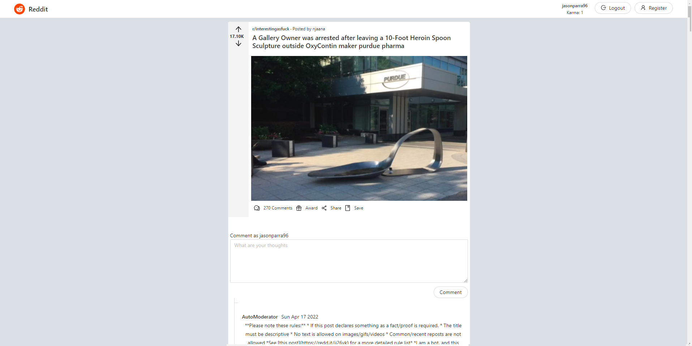
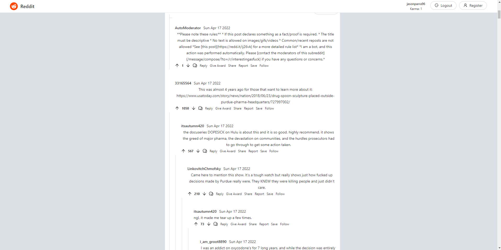

# Reddit client using React.js
> This is a simple client made on react.js using the github official API.

## Technologies Used
- React.js
- Typescript
- Ant Design
- Axios
- Reddit API
- Jest

## Features
- Login / Logout
- Register
- Subreddit page /r/all implemented and custom subreddit as well.
- Detail page for a specific post.
- Likes
- Comments
- Reply

## Screenshots

<!-- If you have screenshots you'd like to share, include them here. -->

## Setup
- install nodeJs

## Usage
`modify .env with custom oauth credentials (optional)`

`npm install`

`npm start`
